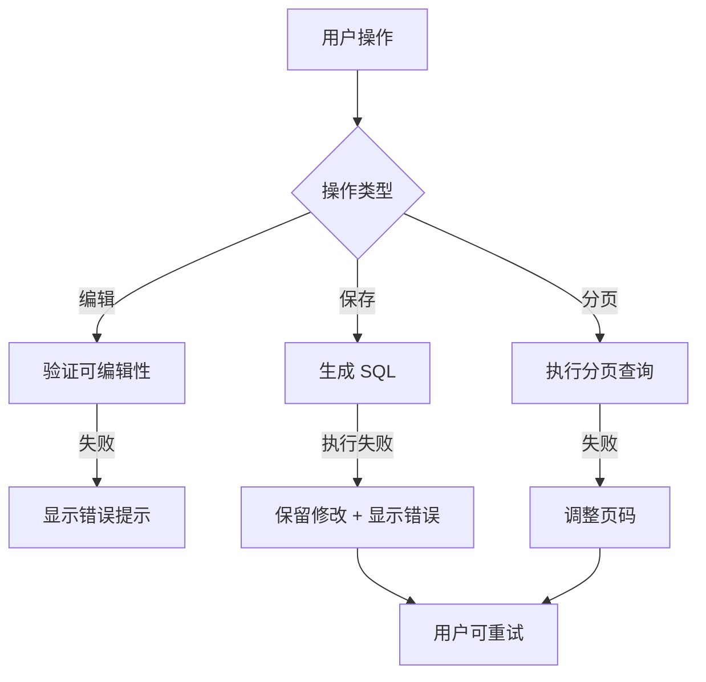

# MySQL 表格直接编辑功能 - 设计文档

## 概述

本功能为 MySQL 查询结果表格添加直接编辑能力，包括查询限制机制、单元格编辑、修改保存和分页功能。设计采用前端状态管理和动态 SQL 生成的方式实现。

## 架构

### 整体架构

```
┌─────────────────────────────────────────────────────────────┐
│                      QueryEditor.vue                        │
│  ┌───────────────────────────────────────────────────────┐  │
│  │              TableDataEditor.vue (新增)               │  │
│  │  ┌──────────────┐  ┌──────────────┐  ┌─────────────┐│  │
│  │  │  可编辑表格  │  │  分页控件    │  │ 保存操作栏  ││  │
│  │  └──────────────┘  └──────────────┘  └─────────────┘│  │
│  └───────────────────────────────────────────────────────┘  │
└─────────────────────────────────────────────────────────────┘
                            │
                            ▼
┌─────────────────────────────────────────────────────────────┐
│                    useMySQLStore (Pinia)                    │
│  - queryLimit: number (10-1000)                             │
│  - applyLimit(sql): string                                  │
└─────────────────────────────────────────────────────────────┘
                            │
                            ▼
┌─────────────────────────────────────────────────────────────┐
│                     mysqlApi                                │
│  - executeQuery()                                           │
│  - updateRecord()                                           │
└─────────────────────────────────────────────────────────────┘
```

## 组件和接口

### 1. TableDataEditor.vue (新建)

主表格编辑组件，整合编辑、分页和保存功能。

#### Props

```typescript
interface Props {
  database: string
  sql: string
  columns: string[]
  data: Record<string, unknown>[]
  primaryKey?: string // 可选，从表结构获取
}
```

#### Emits

```typescript
interface Emits {
  (e: 'refresh'): void
  (e: 'save', updates: UpdateRecord[]): void
}
```

#### State

```typescript
interface EditState {
  // 编辑状态
  editingCell: { rowIndex: number; column: string } | null

  // 修改追踪
  modifiedCells: Map<string, { oldValue: unknown; newValue: unknown }>

  // 分页状态
  currentPage: number
  pageSize: number
  totalCount: number

  // 加载状态
  isSaving: boolean
}
```

#### Methods

- `startEdit(rowIndex, column)` - 开始编辑单元格
- `saveEdit(value)` - 保存单元格编辑
- `cancelEdit()` - 取消编辑
- `generateUpdates()` - 生成 UPDATE 语句
- `saveAllChanges()` - 保存所有修改
- `discardChanges()` - 放弃修改
- `goToPage(page)` - 跳转页面

### 2. useMySQLStore 扩展

在现有 store 中添加查询限制相关状态和方法。

#### 新增 State

```typescript
queryLimit: ref(100) // 默认 100
```

#### 新增 Methods

```typescript
// 应用查询限制到 SQL
applyLimit(sql: string, limit?: number): string

// 保存查询限制设置
saveQueryLimit(limit: number): void

// 加载查询限制设置
loadQueryLimit(): void

// 从 SQL 提取基础查询（移除 LIMIT/OFFSET）
extractBaseQuery(sql: string): string
```

### 3. mysqlApi 扩展

#### 新增接口

```typescript
// 更新单条记录
updateRecord(
  database: string,
  table: string,
  primaryKey: string,
  primaryValue: unknown,
  updates: Record<string, unknown>
): Promise<ApiResponse<void>>

// 获取表主键
getTablePrimaryKey(
  database: string,
  table: string
): Promise<ApiResponse<string>>
```

## 数据模型

### UpdateRecord

```typescript
interface UpdateRecord {
  table: string
  primaryKey: string
  primaryValue: unknown
  column: string
  oldValue: unknown
  newValue: unknown
}
```

### PageQuery

```typescript
interface PageQuery {
  baseSql: string
  limit: number
  offset: number
}
```

### EditableCell

```typescript
interface EditableCell {
  rowIndex: number
  column: string
  isEditing: boolean
  isModified: boolean
  value: unknown
}
```

## 错误处理

### 错误类型

1. **SQL 解析错误**
   - 当无法解析表名或主键时
   - 显示错误提示并禁用编辑功能

2. **UPDATE 执行失败**
   - 约束冲突、权限不足等
   - 显示详细错误信息
   - 保留用户修改以便重试

3. **分页查询失败**
   - OFFSET 超出范围
   - 自动跳转到最后一页

### 错误处理流程



## 测试策略

### 单元测试

1. **SQL 处理函数**
   - `applyLimit()` - 各种 SQL 语句的限制应用
   - `extractBaseQuery()` - 提取基础查询
   - `generateUpdateSQL()` - 生成 UPDATE 语句

2. **状态管理**
   - 修改追踪逻辑
   - 分页状态计算

### 集成测试

1. **编辑流程**
   - 编辑 → 保存 → 执行 → 刷新
   - 编辑 → 取消 → 恢复

2. **分页功能**
   - 分页查询正确性
   - 页码切换逻辑

### 用户场景测试

1. 修改单条记录的多个字段
2. 跨页修改数据（保存后刷新到正确页）
3. 达到查询限制时的行为
4. 并发修改的处理

## UI/UX 设计

### 可编辑单元格样式

- 未修改：默认样式
- 编辑中：蓝色边框 + 输入框
- 已修改未保存：黄色背景标记
- 不可编辑：灰色背景 + 禁用光标

### 保存操作栏

```
┌─────────────────────────────────────────────────────────┐
│ ⚠️ 有 3 处修改未保存                                       │
│ [放弃修改] [保存修改 (3)]                                 │
└─────────────────────────────────────────────────────────┘
```

### 分页控件

```
┌─────────────────────────────────────────────────────────┐
│ ← 上一页    第 1 / 10 页    共 1000 条    下一页 →       │
└─────────────────────────────────────────────────────────┘
```

### 查询限制提示

```
┌─────────────────────────────────────────────────────────┐
│ ℹ️ 结果已限制为前 100 条（可调整）                        │
└─────────────────────────────────────────────────────────┘
```

## 实现决策

### 决策 1：前端状态 vs 后端会话

**选择：前端状态管理**

**理由：**
- 无需后端状态存储，简化架构
- 用户可以跨多个查询窗口独立编辑
- 页面刷新时丢弃未保存修改（合理行为）

### 决策 2：自动保存 vs 手动保存

**选择：手动保存**

**理由：**
- 避免意外修改数据
- 用户可以批量修改后一次性提交
- 减少不必要的数据库请求

### 决策 3：LIMIT 处理方式

**选择：在查询结果中提示，而不是修改原 SQL**

**理由：**
- 保留用户原始 SQL 完整性
- 用户可以明确看到系统做了什么
- 避免复杂的 SQL 解析和重写

### 决策 4：主键获取方式

**选择：查询表结构缓存**

**理由：**
- 准确获取主键信息
- 支持复合主键场景
- 可以复用现有的表结构信息

## 实现考虑

### 性能优化

1. 使用虚拟滚动处理大数据集
2. 修改状态使用 Map 而不是数组，O(1) 查找
3. 分页查询使用索引优化

### 兼容性

1. 支持现有的所有 MySQL 数据类型
2. 处理 NULL 值的编辑
3. 支持特殊字符的转义

### 扩展性

1. 预留批量编辑接口
2. 预留撤销/重做功能
3. 支持自定义编辑器（如日期选择器）
